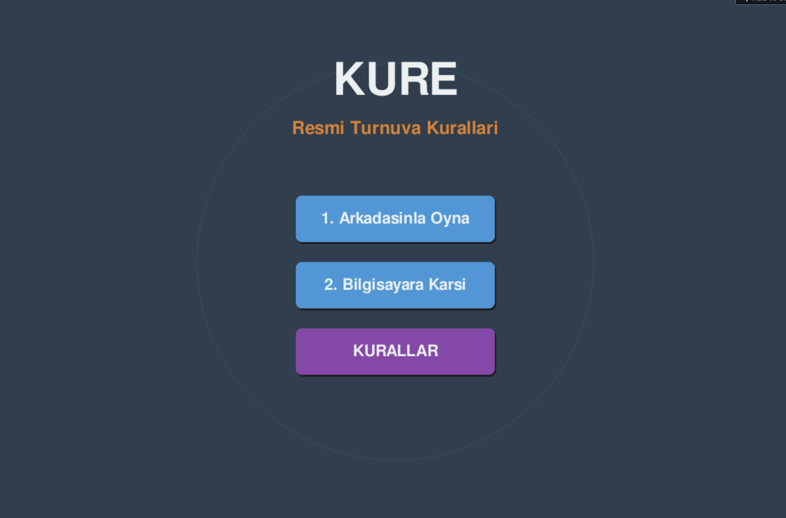
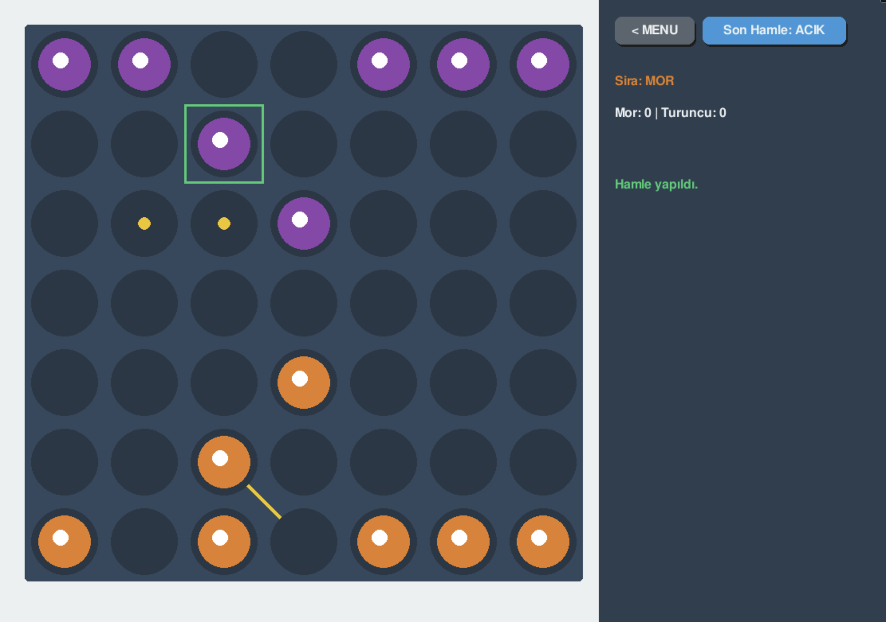
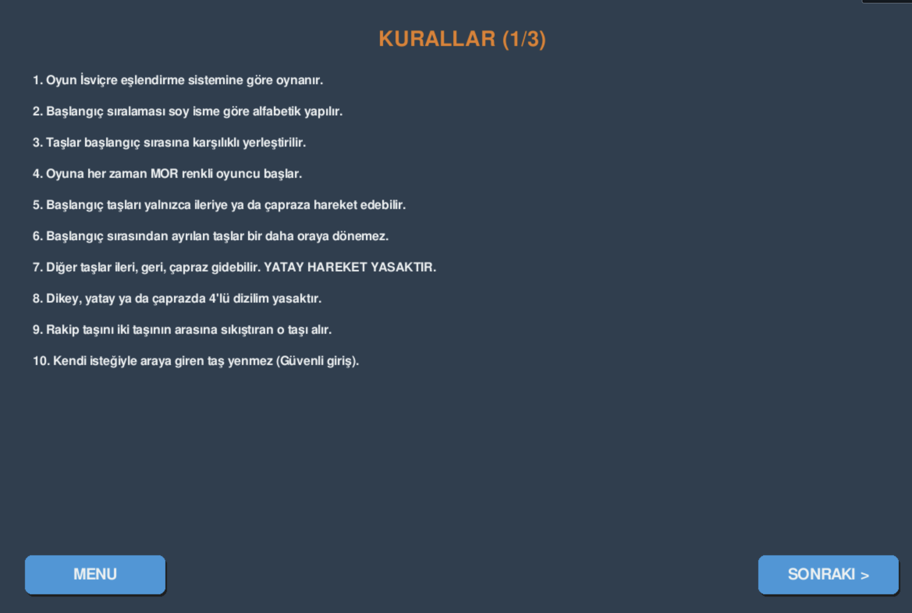

# KURE 

KURE, resmi turnuva kurallarına göre geliştirilmiş, Python ve Pygame kullanılarak oluşturulmuş stratejik bir masa oyunudur. 

## İçindekiler

- [Özellikler](#-özellikler)
- [Kurulum](#-kurulum)
- [Kullanım](#-kullanım)
- [Oyun Kuralları](#-oyun-kuralları)
- [Teknik Detaylar](#-teknik-detaylar)
- [Ekran Görüntüleri](#-ekran-görüntüleri)

## Özellikler

-  **İki Oyun Modu**: Arkadaşınla oyna veya bilgisayara karşı oyna
-  **Yapay Zeka Desteği**: Akıllı AI rakip ile oyun deneyimi
- **Resmi Kurallar**: 25 maddelik resmi turnuva kuralları entegre edilmiştir
-  **Modern Arayüz**: Kullanıcı dostu ve görsel olarak çekici tasarım
- **Kural Kontrolü**: Otomatik kural doğrulama ve uyarı sistemi
- **Oyun İstatistikleri**: Yenilen taş sayısı ve uyarı takibi
- **Hamle İzleme**: Son hamleyi görselleştirme özelliği

##  Kurulum

### Gereksinimler

- Python 3.7 veya üzeri
- Pygame kütüphanesi

### Adımlar

1. Projeyi klonlayın:
```bash
git clone https://github.com/Duyguru/Kure-Strategy-Game.git
cd Kure-Strategy-Game
```

2. Gerekli kütüphaneleri yükleyin:
```bash
pip install -r requirements.txt
```

3. Oyunu çalıştırın:
```bash
python main.py
```

## 🎮 Kullanım

### Oyun Başlatma

1. Programı çalıştırdığınızda ana menü ekranı açılır
2. İki seçenek arasından birini seçin:
   - **Arkadaşınla Oyna**: İki oyuncu aynı bilgisayarda sırayla oynar
   - **Bilgisayara Karşı**: Yapay zeka ile oynarsınız (MOR oyuncu sizsiniz)

### Oyun Kontrolleri

- **Taş Seçme**: Taşa tıklayarak seçin
- **Hamle Yapma**: Seçili taşı geçerli bir kuyuya tıklayarak hareket ettirin
- **Son Hamle**: Sağ paneldeki "Son Hamle" butonu ile son hamleyi göster/gizle
- **Menüye Dön**: Sol üstteki "MENU" butonu ile ana menüye dönün

### Oyun Kuralları

Oyun içindeki "KURALLAR" butonuna tıklayarak 25 maddelik resmi turnuva kurallarını görüntüleyebilirsiniz.

## Oyun Kuralları 

1. Oyun İsviçre eşlendirme sistemine göre oynanır
2. Başlangıç sıralaması soy isme göre alfabetik yapılır
3. Taşlar başlangıç sırasına karşılıklı yerleştirilir
4. Oyuna her zaman **MOR** renkli oyuncu başlar
5. Başlangıç taşları yalnızca ileriye ya da çapraza hareket edebilir
6. Başlangıç sırasından ayrılan taşlar bir daha oraya dönemez
7. Diğer taşlar ileri, geri, çapraz gidebilir. **YATAY HAREKET YASAKTIR**
8. Dikey, yatay ya da çaprazda 4'lü dizilim yasaktır
9. Rakip taşını iki taşının arasına sıkıştıran o taşı alır
10. Kendi isteğiyle araya giren taş yenmez (Güvenli giriş)
11. Hem mor hem turuncu arada kalıyorsa, hamleyi yapan yer
12. Rakibin başlangıç sırasında aynı anda EN FAZLA 1 taşınız bulunabilir
13. **Rakibinin 4 taşını yiyen oyunu kazanır**
14. Dokunulan taş oynanmak zorundadır
15. Taşı kuyuya bıraktığınız an hamle yapılmış sayılır
16. 4'lü yapan oyuncu uyarı alır ve hamlesini geri alır
17. Taş yanlışlıkla düşerse hakem kararına göre düzeltilir
18. Kuralsız hamle yapan uyarı alır. **3 UYARI ALAN KAYBEDER**
19. Centilmenlik dışı davranan cezalandırılır
20. Oyun TEK SET üzerinden oynanır. Kazanan 1 puan alır
21. Oyun sahası dışına çıkan taşlar hakem tarafından yerine konur
22. Geçmiş hamleler için itiraz kabul edilmez
23. Görme engelli yarışmacılar madde 14-15'ten muaftır
24. SAAT KULLANIMI: Tur başına 30 dk.
25. Bu kurallarda belirtilmeyen hususlarda karar yetkisi başhakeme aittir

##  Teknik Detaylar

### Kullanılan Teknolojiler

#### Python 3.x
- **Versiyon**: Python 3.7+
- **Kullanım Amacı**: Ana programlama dili
- **Özellikler**: 
  - Nesne yönelimli programlama (OOP) ile modüler yapı
  - List comprehensions ve generator expressions ile verimli veri işleme
  - Dictionary ve tuple yapıları ile oyun durumu yönetimi

#### Pygame
- **Versiyon**: En son stabil sürüm
- **Kullanım Amacı**: Oyun motoru ve grafik arayüz
- **Kullanılan Özellikler**:
  - **pygame.display**: Ekran yönetimi ve pencere oluşturma (1200x800 çözünürlük)
  - **pygame.draw**: Geometrik şekiller (daireler, dikdörtgenler, çizgiler) çizimi
  - **pygame.event**: Mouse ve klavye olaylarını yakalama
  - **pygame.font**: Metin renderlama ve UI elemanları
  - **pygame.time**: AI hamleleri için zamanlama kontrolü
- **Renk Sistemi**: RGB tuple'ları ile özelleştirilmiş renk paleti
- **UI Bileşenleri**: 
  - Yuvarlatılmış köşeli butonlar (border_radius)
  - Hover efektleri ile interaktif butonlar
  - Metin sarma (text wrapping) özelliği

#### Asyncio
- **Kullanım Amacı**: Asenkron oyun döngüsü yönetimi
- **Özellikler**:
  - `async/await` yapısı ile non-blocking oyun döngüsü
  - AI hamleleri sırasında UI donmasını önleme
  - Event loop ile performans optimizasyonu

### Oyun Mimarisi

#### Tahta Yapısı
- **Boyut**: 7x7 grid (49 kuyu)
- **Veri Yapısı**: 2D liste (nested list) - `[["." for _ in range(7)] for _ in range(7)]`
- **Taş Gösterimi**: 
  - `"M"` = Mor taş
  - `"T"` = Turuncu taş
  - `"."` = Boş kuyu

#### Oyun Durumu Yönetimi
- **KureOyunu Sınıfı**: Oyun mantığını kapsülleyen ana sınıf
- **Durum Değişkenleri**:
  - `tahta`: Mevcut tahta durumu
  - `sira`: Sıradaki oyuncu ("M" veya "T")
  - `secili`: Seçili taşın koordinatları
  - `son_hamle`: Son yapılan hamlenin kaydı
  - `yenen_mor`, `yenen_turuncu`: Yenilen taş sayıları
  - `uyari_m`, `uyari_t`: Oyuncu uyarı sayıları

#### Başlangıç Pozisyonu
- **MOR Taşlar**: Üst sıra (satır 0, tüm sütunlar)
- **TURUNCU Taşlar**: Alt sıra (satır 6, tüm sütunlar)
- **Toplam Taş**: Her oyuncu için 7 taş

### Yapay Zeka Algoritması

Oyun, skor tabanlı bir yapay zeka algoritması kullanır:

#### Hamle Değerlendirme Sistemi
1. **Taş Yeme Hamleleri** (Skor: 100+)
   - Rakip taşını yiyen hamleler en yüksek önceliğe sahip
   - Birden fazla taş yiyen hamleler daha yüksek skor alır

2. **İleri Hamleler** (Skor: 10)
   - Turuncu oyuncu için yukarı (0'a doğru) giden hamleler
   - Agresif oyun stratejisi

3. **Diğer Hamleler** (Skor: 0)
   - Geri veya yan hamleler

#### Algoritma Akışı
```python
1. Tüm olası hamleleri bul
2. Her hamle için simülasyon yap
3. Hamleleri skorlarına göre sırala
4. En yüksek skorlu hamlelerden rastgele birini seç
5. Hamleyi uygula
```

#### Özellikler
- **Minimax Benzeri**: En iyi hamleyi seçer ama derin arama yapmaz
- **Rastgelelik**: Aynı skorlu hamleler arasından rastgele seçim (tekrarlı oyunları önler)
- **Kural Uyumu**: Tüm oyun kurallarını kontrol eder

### Kural Motoru

#### Hamle Geçerliliği Kontrolü
- **Sınır Kontrolü**: Taş tahta dışına çıkamaz
- **Dolu Kuyu Kontrolü**: Dolu kuyuya hamle yapılamaz
- **Yatay Hareket Yasak**: `dy == 0` kontrolü
- **Mesafe Kontrolü**: Maksimum 1 birim hareket (çapraz dahil)
- **Başlangıç Kısıtlamaları**: 
  - Başlangıç taşları sadece ileri gidebilir
  - Başlangıç sırasına geri dönüş yasak
- **Rakip Alan Kısıtı**: Rakip başlangıç sırasında max 1 taş
- **4'lü Dizilim Kontrolü**: Hamle sonrası 4'lü oluşmamalı

#### 4'lü Dizilim Tespiti
Algoritma 4 farklı yönde kontrol yapar:
1. **Yatay Kontrol**: Her satırda aynı oyuncunun 4 taşı
2. **Dikey Kontrol**: Her sütunda aynı oyuncunun 4 taşı
3. **Ana Çapraz**: Sol üstten sağ alta çaprazlar
4. **Ters Çapraz**: Sağ üstten sol alta çaprazlar

#### Taş Yeme Mekanizması
- **8 Yönlü Kontrol**: Her taş için 8 komşu pozisyon kontrol edilir
- **Sıkıştırma Mantığı**: 
  - Rakip taş → Oyuncu taşı → Oyuncu taşı dizilimi
  - Ortadaki rakip taş yenir
- **Güvenli Giriş**: Kendi isteğiyle araya giren taş yenmez

#### Uyarı Sistemi
- **Kuralsız Hamle**: Geçersiz hamle yapıldığında uyarı +1
- **4'lü Yapma**: 4'lü dizilim oluşturulduğunda uyarı +1
- **Oyun Kaybı**: 3 uyarı alan oyuncu oyunu kaybeder

#### Oyun Bitiş Kontrolü
- **Kazanma Koşulları**:
  - Rakibin 4 taşını yemek
  - Rakibin 3 uyarı alması
- **Oyun Durumu**: `oyun_bitti` flag'i ile kontrol edilir

## 📸 Ekran Görüntüleri


*Ana menü ekranı*


*Oyun tahtası ve arayüz*


*Oyun kuralları sayfası*

> **Not**: Ekran görüntüleri `screenshots/` klasörüne eklenebilir.

##  Katkıda Bulunma

Katkılarınızı bekliyoruz! Lütfen:

1. Bu projeyi fork edin
2. Yeni bir branch oluşturun (`git checkout -b feature/yeni-ozellik`)
3. Değişikliklerinizi commit edin (`git commit -am 'Yeni özellik eklendi'`)
4. Branch'inizi push edin (`git push origin feature/yeni-ozellik`)
5. Bir Pull Request oluşturun

---
